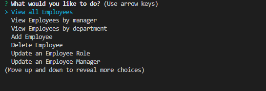
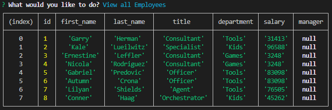

# Module 12 - Employee Tracker

## Description

This command line application is designed to access a database to view and manage the departments, roles, and employees in a company to assist with organisation and structure.

## Table of Contents 

* [Installation](#installation-instructions)

* [Usage](#usage-information)

* [License](#license)

* [Contributing](#contributing-guidelines)

* [Tests](#test-instructions)

* [Questions](#questions)

## Installation Instructions

Please follow these steps when running this application.   1. git clone the repository to your local machine.  2. Open the '.env.example' file and fill in your credentials then rename the file to '.env'  3. In terminal, CD into the db folder.  4. type mysql -u (username) -p then hit enter, then enter your password.  5. type source ./schema.sql then hit enter. The schema will run and create the database. (type quit in terminal after)  6. In terminal again, CD out of db into the application's folder.  7. Type and enter 'npm install' to install the dependencies.  8. if you want to have example seed data for your database type 'npm run seed', wait a few moments then ctrl+c and hit y to exit out.  9. Type and enter 'node app.js' to run the application.

## Usage Information

This project should be used to replicate a sample workplace structure, listing everything from departments, roles, employees etc. and/or provide an open source code for users to see how to create an application similar to this one. 

Sample:

video walkthrough:

  https://1drv.ms/v/s!Avf51vHVO9u7mDJf66S-ONP0QGqS

## License

MIT: Permissive free license software. Please visit https://opensource.org/licenses/MIT for more information.
  
## Contributing Guidelines

Flipper5001 was the sole contributer for this project. If you wish to make any contributions, please refer to the questions section for our contact information.

## Test Instructions

The application is designed to receive a variety of inputs as salary, role, department etc can be adjusted and changed to suit the users needs. 

## Questions

Other works can be found on https://github.com/Flipper5001.

If you have any questions or queries, please contact the following email address and we will get back to you as soon as possible.  
placeholder@gmail.com

